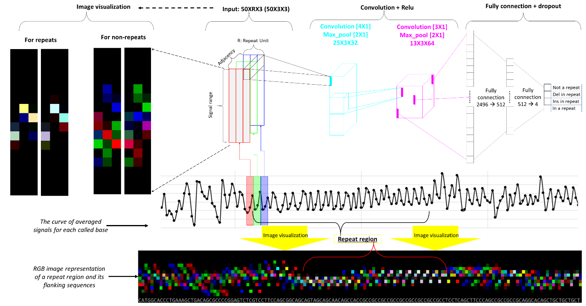

# DeepRepeat: Estimation of short tandem repeats by deep learning on Oxford Nanopore sequencing signals data 

In DeepRepeat, we reasonably assume that directly adjacent repeats share similar signal distribution. And then, we convert a repeat and its upstream and downstream repeats into RGB channels of a color image, feed images of repeats and non-repeats into a deep convolutional neural network to learn whether an event of signals are in a repeat or not, and determine repeat counts for individuals by aligning long reads against a reference genome and by summarizing and modeling the repeat prediction for a certain allele from multiple reads with Gaussian mixture distribution. 

# System requirements
## Hardware requirements
There is specific hardware requirements to use DeepRepeat if you can successfully install all dependent packages. If you want to train your own DeepRepeat models, you need a computing node with tens of GB memory.

## Software requirements
Please refer to `environment.yml` for detail. For your quick reference, DeepRepeat needs
```
  - python=3.6
  - hdf5=1.10.1
  - htslib=1.9
  - scikit-learn
  - tensorflow=1.9
  - samtools
  - minimap2
  - gxx_linux-64
```

# Installation
## Install DeepRepeat with docker

If you have docker, a simple way to run DeepRepeat is to use docker. The simple commands is
```
docker run --rm genomicslab/deeprepeat:0.1.3
```

If you can want to build docker images for DeepRepeat, please follow the commands below:
```
git clone https://github.com/WGLab/DeepRepeat
cd DeepRepeat
docker build -t deeprepeat:0.1.3 .
```

## Install DeepRepeat via conda 
It is also easy to install the dependent packages of DeepRepeat using `anaconda`. Thus, please install `anaconda` first, and then follow the commands below to install DeepRepeat.

```
git clone https://github.com/WGLab/DeepRepeat
cd DeepRepeat
conda env create -f environment.yml
source activate py36deeprepeat   #if you change conda env name, please replace `py36deeprepeat`
cd bin/scripts
export DR_conda_base="/home/xxx/anaconda2/envs/py36deeprepeat/"   #replace this folder for your own anaconda folder of py36deeprepeat
g++ -O3 -std=c++11 -o IndexF5files ComFunction.c Fast5Index.c IndexF5files.c
h5c++ -O3 -std=c++11 -I $DR_conda_base/include -L$DR_conda_base/lib -lhts -o genomic1FE ComFunction.c ComOption.c BamReader.c Fast5Index.c Fast5Reader.c RepeatFeatExtract.c genomic1FE.c $DR_conda_base//lib/libhdf5_hl_cpp.a $DR_conda_base//lib/libhdf5_cpp.a $DR_conda_base//lib/libhdf5_hl.a $DR_conda_base//lib/libhdf5.a -lz -ldl -lpthread
cd ../../
```

Then, you can run `python DeepRepeat.py`


# General Usage
After installation, simply type `python DeepRepeat/bin/DeepRepeat.py Detect` will tell you the options.
```
usage: DeepRepeat.py [-h] {Detect} ...

Determine microsatellite repeat of interests using Nanopore signals.

positional arguments:
  {Detect}
    Detect    Detect repeat counts of locus of interest

optional arguments:
  -h, --help  show this help message and exit

For example,
        python DeepRepeat.py Detect: detect repeat counts of locus of interest
usage: DeepRepeat.py Detect [-h] [--f5folder F5FOLDER] [--bam BAM] [--o O]
                            [--f5i F5I] [--repeat REPEAT]
                            [--repeatName REPEATNAME] [--rpg RPG]
                            [--f5config F5CONFIG] [--nbsize NBSIZE]
                            [--is_pcr IS_PCR] [--UniqueID UNIQUEID]
                            [--basecalled_path BASECALLED_PATH]
                            [--summary_file SUMMARY_FILE] [--multif5 MULTIF5]
                            [--mod_path MOD_PATH] [--epchon EPCHON]
                            [--repeat_relax_bp REPEAT_RELAX_BP]
                            [--TempRem TEMPREM] [--gn GN] [--algLen ALGLEN]

Detect repeat counts of locus of interest

optional arguments:
  -h, --help            show this help message and exit
  --bam BAM             The bam file. Compulsory.
  --o O                 The output folder. Compulsory.
  --f5i F5I             The index of f5 files. If empty, `f5.f5index` under `f5folder` will be used. If not exist, `f5.f5index` will be created. Must end with "f5index".
  --repeat REPEAT       The locus of repeat of interest. For example: "chr4:3074876-3074933:CAG:3". Compulsory.
  --repeatName REPEATNAME
                        The name of the repeat. Default:m_repeat.
  --rpg RPG             The bed file for neighborhood repeat. If not provided, `data/trf.v0.bed` will be used.
  --f5config F5CONFIG   The config file of basecalling. Default: data/config/fast5_path.config
  --nbsize NBSIZE       The size for neighborhood(for feature generation). Minus values for percentage, while plus values for absolute size.
  --is_pcr IS_PCR       Is the data is PCR-based. Default: False.
  --UniqueID UNIQUEID   Unique name for the results. Default: "_mpred_".
  --basecalled_path BASECALLED_PATH
                        The basecalled f5 files under the data folder. Default: "workspace/pass/".
  --summary_file SUMMARY_FILE
                        The summary file of basecalling under the data folder. Default: "sequencing_summary.txt" under data folder.
  --multif5 MULTIF5     Is multi-fast5 format. Default: False (single-fast5 format).
  --mod_path MOD_PATH   The path of well-trained models. If not provided, it will be automatically generated according to repeat patterns. You need provide the path if you have your own trained models.
  --epchon EPCHON       The well-trained models with epcho. Default: 200.
  --repeat_relax_bp REPEAT_RELAX_BP
                        Relaxed nb size (for prediction). Default: 15.
  --TempRem TEMPREM     Will Temp files be removed? Default: True (yes).
  --gn GN               Well-trained models for a genome('hx1', 'na12878' or 'hx1-na12878'). Default: 'hx1-na12878'.
  --algLen ALGLEN       Minimal alignment length. Default: 100.

Common options for DeepRepeat:
  --f5folder F5FOLDER   The folder path where is the f5 files for Nanopore data.

```

# Testing examples

After you download the DeepRepeat software, if you want to test-run it, please refer to [Reproducible examples](https://github.com/WGLab/DeepRepeat/blob/master/docs/Reproducibility.md) to download the testing data sets. You can follow the step-by-step instructions in the page to see how to run the program and how to interpret the results.

# Model design

Illustration on how to convert Nanopore signals for deep learning prediction of simple repeats. Each dot in the curve in black represents an event (move) in Nanopore data, and is represented by a column in a channel. R: the size of repeat motif, for example, R=3 for trinucleotide repeats. Del: deletion indicating 1 bp deletion compared against the repeat motif of interest; Ins: insertion indicating 1 bp insertion compared against the repeat motif of interest. In the bottom and the left, an ideal image representation of repeat regions is white dots, while the image representation of non-repeat regions is dispersed red or blue or green or their less mixture. Each basecalled nucleotide in the sequence of the bottom subfigure is for a column but for demonstration purpose.



# Revision history
For release history, please visit [here](https://github.com/WGLab/DeepRepeat/releases). 

# Getting help
Please refer to the [DeepRepeat issue pages](https://github.com/WGLab/DeepRepeat/issues) for posting your issues. We will also respond your questions quickly. Your comments are criticl to improve our tool and will benefit other users.

# License

DeepRepeat is under GPLv3. 

# Citing DeepRepeat
***Please cite the publication below if you use our tool***

Qian Liu, Li Fang, Alex Mas Monteys, Pedro Gonzalez-Alegre, Beverly L. Davidson, Kai Wang. Direct detection and quantification of short tandem repeats 
on ionic signal data from Nanopore sequencing.


